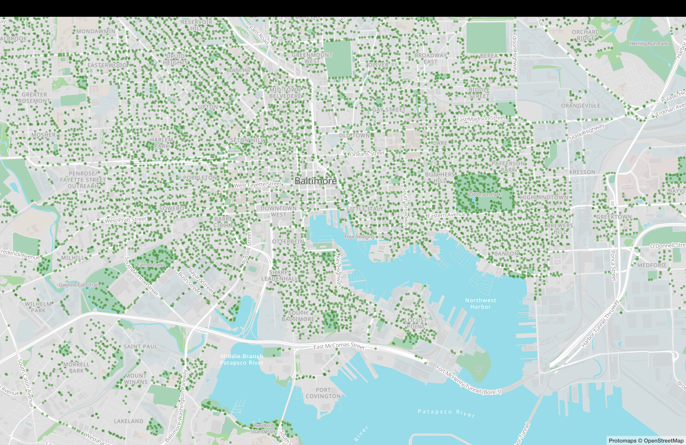

# How your newsroom can build a self-hosted map stack

Useful links:

- [A guide to self-hosting maps](https://www.muckrock.com/news/archives/2024/feb/13/release-notes-how-to-make-self-hosted-maps-that-work-everywhere-cost-next-to-nothing-and-might-even-work-in-airplane-mode/)
- [Codespace: Self-hosted maps with PMTiles](https://github.com/eyeseast/self-hosted-maps-codespace)
- [Codespace: A tilemaker starter kit](https://github.com/eyeseast/tilemaker-map-template)
- [Cost calculator for PMTiles](https://docs.protomaps.com/deploy/cost)

Have fun. If you get lost, find me on [mastodon](https://journa.host/home).
